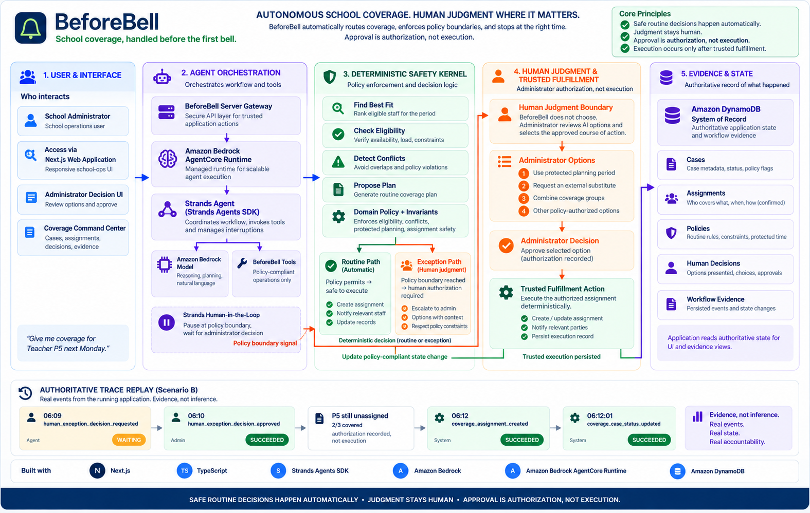
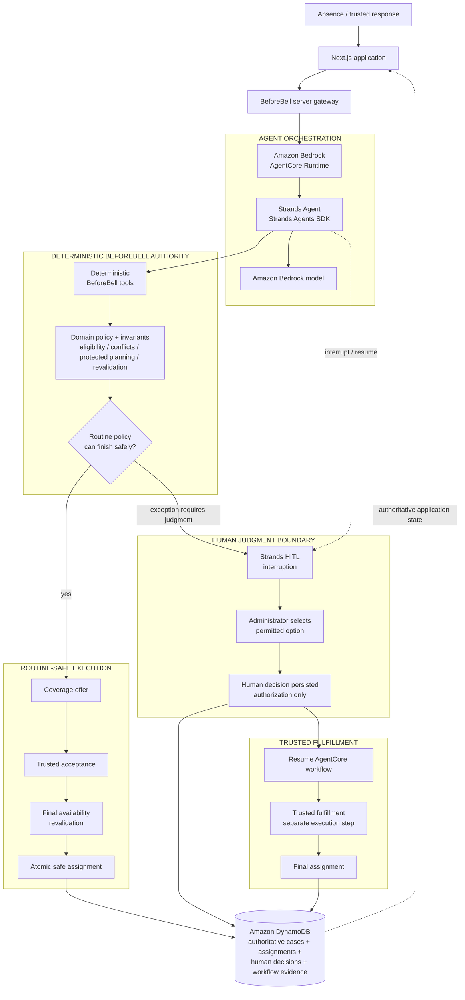
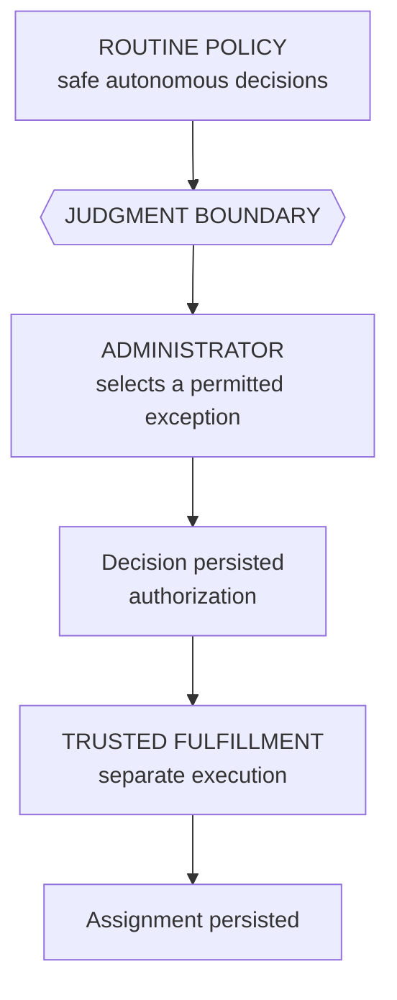

# BeforeBell

**School coverage, handled before the first bell.**

BeforeBell handles routine teacher-absence coverage automatically and brings in an administrator only when a decision genuinely needs human judgment.

> **Safe routine decisions happen automatically. Judgment stays human.**
>
> **Approval is authorization, not execution.**

## Judge fast path

**[Try BeforeBell](https://main.d2taas9lovobkr.amplifyapp.com/)** · **[Watch the demo](https://youtu.be/7bp7_NHUqFA)** · **[Read the AWS build story](https://builder.aws.com/content/3IHfF2ty2FJ7ufZRiYsHG0qFSxN/building-beforebell-for-agents-for-humans-autonomous-school-coverage-with-human-judgment)** · **[View the architecture](#architecture)** · **[See the operational proof](#operational-evidence-instead-of-hidden-reasoning)**

Built for the **Agents for Humans Hackathon 2026** with **Strands Agents SDK, Amazon Bedrock, Amazon Bedrock AgentCore Runtime, and Amazon DynamoDB**.

### The 30-second thing to notice

BeforeBell's most important behavior is easy to miss if you only think of it as teacher-coverage software.

In the exception workflow, an administrator can approve an external substitute and the affected period still remains **unassigned**.

The approval gives BeforeBell permission to continue.

It does **not** create the assignment.

Only a later trusted fulfillment step can make the coverage real.

That is the idea behind:

**Approval is authorization, not execution.**

---

## The problem

A teacher calling in absent before the school day starts can trigger a surprisingly repetitive coordination workflow:

- identify every affected class period;
- find staff who are actually available and eligible;
- reject timetable conflicts;
- respect workload limits and protected planning periods;
- prefer appropriate qualifications;
- contact a safe candidate;
- handle acceptance or decline;
- revalidate before final assignment; and
- involve an administrator only when routine policy can no longer safely resolve the case.

All of that is happening while the first bell is getting closer.

The problem is not that administrators cannot make these decisions.

It is that they can spend some of their most time-sensitive morning minutes coordinating routine work before they ever reach the decisions that genuinely need them.

BeforeBell turns that process into one bounded agentic workflow.

---

## Why this problem matters

This is not just a hypothetical school workflow.

In October 2024, **50% of U.S. public-school leaders reported that their school felt understaffed**.

Among schools operating with at least one teaching or non-teaching staff vacancy, **42% reported increased use of teachers outside their intended duties, while 43% reported increased use of non-teaching staff outside their intended duties**.

Substitute availability remains a major constraint too. RAND's American School District Panel found that **half of surveyed U.S. school districts still reported a considerable shortage of substitute teachers in fall 2023**.

There is also evidence of what happens when normal substitute coverage fails.

In a detailed study using data from a large urban school district, uncovered teacher absences were handled by:

- splitting students into other classrooms about **37%** of the time;
- using another teacher during a prep period about **35%** of the time; and
- having an administrator cover the class about **12%** of the time.

Those fallback options look remarkably similar to the exact pressure BeforeBell is designed around: protect planning periods, avoid unnecessary disruption to other classrooms, find safe coverage when possible, and involve an administrator when routine options are no longer enough.

BeforeBell does **not** claim to solve teacher or substitute shortages.

It targets the coordination pressure those shortages and everyday absences create.

The goal is narrower and measurable:

> **Find safe coverage quickly, preserve teachers' protected time whenever routine policy allows, reduce unnecessary administrator involvement, and keep unresolved periods visible until coverage actually exists.**

**Evidence sources:** National Center for Education Statistics School Pulse Panel, October 2024 staffing findings; RAND, *Staffing, Budget, Politics, and Academic Recovery in Districts: Selected Findings from the Fall 2023 American School District Panel Survey*; Liu, Loeb, and Shi, *More Than Shortages: The Unequal Distribution of Substitute Teaching* (Education Finance and Policy, 2022).

---

## Why BeforeBell is different

Teacher-absence coverage itself is not the invention behind BeforeBell.

Schools already have timetables, staffing rules, substitute processes, and people capable of deciding who should cover a class.

The part BeforeBell rethinks is:

> **How much routine operational work should an autonomous agent be allowed to complete before human authority is genuinely required?**

BeforeBell is not another chatbot sitting beside an administrator and suggesting possible substitutes.

It is also not trying to automate every decision simply because an AI model is available.

The system is built around a different operating model:

> **Automate routine coordination end to end, and stop exactly where judgment begins.**

For routine cases, BeforeBell can carry the workflow from an absence through candidate evaluation, policy checks, offers, trusted responses, assignment, and persisted evidence without requiring an administrator to approve something the system already knows is safe.

But when the workflow reaches a policy boundary, the agent deliberately loses authority.

It stops.

A human makes the judgment call.

And even then, the human decision does not magically become operational truth.

**Approval is authorization, not execution.**

The administrator decides what the school is willing to do.

Trusted fulfillment still has to prove that the approved action can actually happen before BeforeBell changes authoritative assignment state.

That creates three distinct responsibilities:

1. **The agent coordinates the work.**
2. **The human owns exceptional judgment.**
3. **Trusted fulfillment proves that the authorized action actually happened.**

The AI model can reason about the workflow.

It cannot simply decide what becomes true.

That separation between **autonomy, judgment, and execution** is the central idea behind BeforeBell.

---

## Built and verified

BeforeBell is a working hosted prototype rather than a static product mockup.

The current build includes:

- **Amazon Bedrock AgentCore Runtime** — deployed agent runtime;
- **Strands Agents SDK** — agent orchestration and human-in-the-loop interruption;
- **Amazon Bedrock** — model inference and reasoning;
- **Amazon DynamoDB** — authoritative operational state and workflow evidence;
- **deterministic coverage and school-policy tools**;
- **separate authorization and trusted fulfillment stages**;
- **a hosted web application**;
- **a live operational evidence view**;
- **3 end-to-end synthetic demo scenarios**;
- **27 automated test files**; and
- **186 passing tests**.

The project also passes the full development quality gate:

```bash
npm run lint
npx tsc --noEmit
npm test
npm run build
npm audit
```

---

## What BeforeBell does

For a teacher absence, BeforeBell can:

1. load the authoritative absence case;
2. retrieve the school's coverage policy;
3. identify eligible candidates;
4. reject conflicts and policy violations;
5. rank safe candidates;
6. create a coverage offer;
7. react to trusted acceptance or decline events;
8. revalidate availability before assignment;
9. atomically commit safe coverage;
10. interrupt for administrator judgment when routine policy cannot safely continue;
11. resume after an authoritative human decision; and
12. preserve operational evidence in DynamoDB.

---

## Demo scenarios

All demo people, schedules, schools, absences, and coverage events are synthetic.

### Scenario A — Autonomous routine success

**Sarah Miller — Grade 8 Math**

Affected periods:

`P1 · P2 · P4 · P6`

Alex Johnson is the only candidate who can safely cover the complete absence.

BeforeBell evaluates the case, applies routine policy, completes coverage, and resolves the workflow without asking an administrator to approve something already permitted by policy.

**Result**

- 4/4 periods covered;
- one safe candidate;
- zero administrator decisions; and
- case automatically resolved.

This is the routine path BeforeBell is designed to remove from an administrator's morning.

---

### Scenario B — Human judgment boundary

**Daniel Reed — Grade 7 Science**

Affected periods:

`P2 · P3 · P5`

Routine policy safely resolves P2 and P3.

P5 is different.

The available internal option would require using a protected planning period.

BeforeBell therefore stops instead of silently overriding policy and creates a real Strands human-in-the-loop interruption.

The administrator receives bounded options including:

- use the protected planning period;
- request an external substitute; or
- combine coverage groups.

For the centerpiece demo, the administrator chooses the external-substitute path.

But approval does not immediately cover P5.

At the moment the administrator authorizes that option, P5 still has **no confirmed assignment**.

A later trusted fulfillment action confirms Morgan Ellis and creates the assignment.

**Result**

- P2/P3 automatically assigned to Jordan Lee;
- P5 reaches the human judgment boundary;
- administrator approves an external substitute;
- P5 remains unassigned after approval;
- trusted fulfillment later records Morgan Ellis;
- 3/3 periods covered; and
- one human decision preserved as evidence.

This scenario demonstrates BeforeBell's central invariant:

> **Approval is authorization, not execution.**

The administrator decides what the school is willing to do.

The system still has to prove that it actually happened.

---

### Scenario C — Safe fallback after decline

**Olivia Chen — English**

Affected periods:

`P1 · P3 · P6`

Emma Brooks is initially ranked first but declines.

That decline becomes authoritative state.

BeforeBell does not continue as though the original plan succeeded.

It replans without Emma, evaluates the remaining eligible options, offers the complete absence to Noah Carter, waits for trusted acceptance, revalidates the accepted offer, and completes coverage.

**Result**

- Emma Brooks: declined;
- Noah Carter: assigned 3/3;
- zero administrator decisions; and
- case safely resolved.

Scenario C demonstrates that autonomous operation also requires explicit failure and recovery behavior rather than only a scripted happy path.

---

## Architecture

BeforeBell deliberately separates **agent orchestration, deterministic policy authority, human judgment, trusted fulfillment, and authoritative evidence**.



### Runtime architecture

- **Strands Agents + Amazon Bedrock** coordinate the coverage workflow.
- **Deterministic BeforeBell tools** own eligibility, conflicts, protected planning, assignment safety, final revalidation, and workflow invariants.
- When routine policy cannot safely finish the work, **Strands HITL interrupts the agent** and hands a bounded decision to an administrator.
- **Administrator approval is authorization, not execution.** The decision is persisted first; trusted fulfillment happens separately.
- **Amazon DynamoDB is the system of record** for authoritative cases, assignments, policies, human decisions, and workflow evidence.



> **Design principle:** safe routine decisions happen automatically. Judgment stays human.

### The judgment boundary



> **ADMINISTRATOR APPROVAL is authorization, not execution.**

Scenario B makes that boundary concrete: the administrator's decision is persisted first, P5 remains unassigned, and only a later trusted-fulfillment action creates the final assignment.

---

## Responsibility boundaries

BeforeBell does not treat "the agent" as one unlimited authority.

Different parts of the system own different responsibilities.

### Agent / language model

The Strands agent coordinates the workflow and selects which permitted tool to invoke next.

The model can reason about what should happen.

It does **not** decide that an unsafe assignment has become valid.

It cannot invent authoritative availability, qualifications, policies, offers, candidate responses, assignments, human decisions, or successful side effects.

### Deterministic policy layer

The application and domain layers own:

- staff availability;
- schedule conflicts;
- qualification preference;
- daily coverage limits;
- protected planning periods;
- stale and expired offers;
- assignment invariants;
- idempotency;
- final revalidation; and
- race-safe persistence.

If an invariant must remain true before authoritative state changes, it is enforced in deterministic code rather than relying only on a model instruction.

### Human administrator

Human judgment is required when the workflow crosses a defined policy boundary, including:

- using a protected planning period;
- combining coverage groups; and
- requesting an external substitute.

The administrator receives bounded options produced by the trusted workflow rather than an unrestricted mutation interface.

### Trusted fulfillment

Human approval authorizes a permitted path.

Trusted fulfillment owns the later operational step that makes the approved action real.

BeforeBell revalidates before changing authoritative assignment state.

---

## Technology

- **Strands Agents SDK** — agent orchestration and HITL;
- **Amazon Bedrock** — model inference and reasoning;
- **Amazon Bedrock AgentCore Runtime** — deployed agent runtime;
- **Amazon DynamoDB** — authoritative operational state and evidence;
- **AWS SDK for JavaScript v3**;
- **Next.js**;
- **React**;
- **TypeScript**;
- **Zod**; and
- **Vitest**.

Specific framework version numbers are intentionally left to `package.json`, which remains the authoritative dependency manifest.

---

## Reliability model

BeforeBell is built around explicit operational invariants:

- no duplicate candidate-period assignment;
- no expired-offer assignment;
- no final assignment without an accepted active offer or approved exception path;
- availability is checked again immediately before assignment;
- duplicate external events are idempotent;
- assignment races are protected by atomic DynamoDB writes;
- administrator approval is not treated as execution;
- declined candidates remain excluded from fallback planning;
- authoritative state is read from persistence rather than inferred from agent narration; and
- exception paths cannot silently widen the authority given to the agent.

These constraints matter because BeforeBell is allowed to perform state-changing work.

A reasonable model answer is not enough.

The application must still prove that the requested state transition is permitted.

---

## Operational evidence instead of hidden reasoning

BeforeBell does not expose private model reasoning.

The product presents operational evidence from authoritative application state:

- coverage assignments;
- coverage offers;
- human decisions;
- activity events;
- current case state; and
- confirmed period coverage.

Amazon DynamoDB remains the system of record.

The interface therefore shows what actually happened rather than what the agent believes happened.

> **Evidence, not inference.**

### Scenario B authoritative evidence trace

The Scenario B command center makes the human/machine boundary visible directly in the product.

For the centerpiece external-substitute path, BeforeBell persists this authoritative sequence:

```text
06:09:00  agent          waiting
            human_exception_decision_requested

06:10:00  administrator  succeeded
            human_exception_decision_approved

            P5 STILL UNASSIGNED
            authorization recorded, not execution

06:12:00  system         succeeded
            coverage_assignment_created

06:12:01  system         succeeded
            coverage_case_status_updated
```

This sequence demonstrates the central invariant:

> **Administrator approval is authorization, not execution.**

At 06:10, the administrator has approved the external-substitute path.

P5 is still unassigned.

Only the later trusted fulfillment step creates Morgan Ellis's P5 assignment and allows the case to become resolved.

The command center keeps human operations separate from machine operations:

- current assignments remain a persisted state snapshot;
- administrator judgment is shown as a human control boundary;
- workflow events are shown as a persisted orchestration trace; and
- resolved cases replay completed evidence rather than presenting historical events as though they were still live.

---

## How we would measure real-world impact

BeforeBell currently uses synthetic school, teacher, timetable, and absence data, so the project does **not** claim measured real-world time savings yet.

A real-school pilot would evaluate concrete operational outcomes including:

- time from absence intake to confirmed coverage;
- percentage of routine periods resolved without administrator intervention;
- number of administrator actions required per absence case;
- number of protected planning periods consumed for coverage;
- percentage of affected periods still unresolved when the school day begins;
- failed or conflicting assignment attempts;
- time between authorization of an exception and confirmed fulfillment; and
- percentage of cases whose final state can be reconstructed from persisted evidence.

Success should not simply mean that the agent produced a convincing answer.

It should mean that routine coordination became faster and required less human intervention **without weakening school policy, teacher protections, or accountability**.

---

## Project structure

```text
src/
  agent/             Strands agent and tool adapters
  agentcore/         AgentCore HTTP runtime
  application/       Workflow actions and reliability controls
  domain/            Policy, eligibility, planning and invariants
  infrastructure/    DynamoDB persistence
  server/            Next.js server gateways and read models
  app/               Web and API routes
  components/        Product UI
  demo/              Synthetic demo definitions
  fixtures/          Riverside synthetic fixtures
  test/              Baseline tests

scripts/
  Strands / Bedrock smoke tests
  AgentCore local and remote tests
  DynamoDB workflow and race tests
  HITL workflow verification
  Synthetic demo seeding
```

---

## Local development

### Requirements

- Node.js 20+;
- npm;
- an AWS identity with appropriate permissions for the resources being tested;
- Amazon Bedrock model access;
- a DynamoDB table for Dynamo-backed workflows; and
- an AgentCore runtime ARN for remote runtime tests.

The project has been validated with Node.js 24.

### Install

```bash
npm ci
```

### Environment

Copy:

```text
.env.example
```

to:

```text
.env.local
```

and replace the resource placeholders with your own configuration.

Do not place long-lived AWS credentials in the repository.

For local development, authenticate through the AWS CLI separately.

### Run

```bash
npm run dev
```

### Quality gates

```bash
npm run lint
npx tsc --noEmit
npm test
npm run build
npm audit
```

Current automated baseline:

**27 test files · 186 tests**

---

## AgentCore runtime

The deployed runtime exposes:

- `GET /ping`
- `POST /invocations`

The invocation boundary supports domain-scoped coverage coordination and HITL resume using the authoritative runtime session and interruption identifiers.

The BeforeBell browser gateway does not expose an arbitrary agent-prompt interface.

AgentCore is therefore part of the running workflow rather than a technology name added only to the submission.

---

## Security choices

BeforeBell intentionally keeps the agent behind narrow application boundaries.

Current security choices include:

- no AWS access keys committed to the repository;
- local `.env*` files ignored;
- `.env.example` containing identifiers and placeholders only;
- hosted AWS access designed around IAM roles;
- AgentCore invocation going through the server boundary;
- demo mutation APIs being fixed-purpose rather than arbitrary mutation endpoints;
- deterministic application code authorizing assignments;
- browser clients not receiving unrestricted agent authority;
- synthetic data used throughout the demonstration; and
- patched versions enforced for security-sensitive transitive dependencies.

---

## Prototype scope and production path

BeforeBell is a hackathon prototype designed to demonstrate the complete authority model and operational workflow using synthetic school data.

The current build uses the active AgentCore runtime session for immediate HITL interruption and resume.

A production deployment designed for longer administrator wait periods would persist resumable workflow state independently so outstanding interruptions can survive runtime recycling and longer-lived operational delays.

A real deployment would also connect the same workflow boundaries to production systems such as:

- authenticated school roles;
- timetable and staff systems;
- trusted absence-intake channels;
- staff notification providers;
- external substitute providers;
- school-specific policy configuration;
- production monitoring and audit tooling;
- multi-school or district tenancy; and
- reporting on recurring staffing and coverage pressure.

The important part is that those integrations would not change BeforeBell's central authority model:

> **The agent coordinates. Deterministic policy protects routine operations. Humans own judgment. Trusted fulfillment makes authorized actions real.**

---

## Synthetic data

Riverside Community School and every person, schedule, absence, assignment, offer, and coverage event in this repository are synthetic.

BeforeBell does not require student grades, parent information, payroll data, or unrelated school records for its coverage workflow.

The synthetic scenarios are intended to demonstrate workflow behavior, authority boundaries, failure handling, and evidence persistence without introducing real school or personal data.

---

## What's next for BeforeBell

The immediate next step beyond the hackathon prototype would be validating the system with real school-operations users and measuring whether it actually reduces routine coordination work.

Potential product directions include:

- real timetable and staff integrations;
- secure absence intake;
- automated notifications and coverage offers;
- richer school-specific coverage policies;
- substitute-provider integrations;
- durable resumable workflow recovery;
- multi-school and district operations;
- staffing-pressure analytics; and
- broader school workflows where routine coordination can be automated while human judgment remains protected.

The broader opportunity goes beyond teacher absence.

Schools contain a lot of repetitive operational work where people spend time moving information and coordinating routine decisions even though their judgment is only genuinely required at certain moments.

BeforeBell's long-term goal remains simple:

> **Remove routine coordination from administrators without removing administrators from the decisions that require judgment.**

---

## License

MIT — see [LICENSE](./LICENSE).
