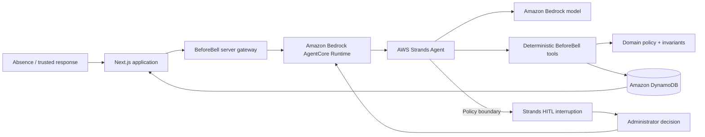

# BeforeBell

**School coverage, handled before the first bell.**

BeforeBell is an autonomous school-operations agent that coordinates staff coverage when a teacher is absent.

Routine, policy-safe decisions happen automatically. Decisions that cross a genuine judgment boundary stop for a human.

Built for the **Agents for Humans Hackathon 2026**.

---

## The problem

A teacher absence can create a surprisingly repetitive coordination workflow:

- identify every affected class period;
- check staff availability;
- reject schedule conflicts;
- respect coverage limits and protected periods;
- prefer appropriate qualifications;
- contact a safe candidate;
- handle acceptance or decline;
- revalidate before final assignment;
- escalate only when routine policy cannot safely resolve the absence.

BeforeBell turns that process into one bounded agentic workflow.

## Core principle

> **Safe routine decisions happen automatically. Judgment stays human.**

The language model is an orchestrator, not the policy engine.

BeforeBell's deterministic domain and application code decides whether a candidate or assignment is permitted. The agent cannot invent availability, qualifications, policies, offers, candidate responses, assignments, or successful side effects.

## What BeforeBell does

For a teacher absence, BeforeBell can:

1. load the authoritative absence case;
2. retrieve the school's coverage policy;
3. identify eligible candidates;
4. reject conflicts and policy violations;
5. rank safe candidates;
6. create a coverage offer;
7. react to trusted acceptance or decline events;
8. revalidate availability before assignment;
9. atomically commit safe coverage;
10. interrupt for administrator judgment when routine policy cannot safely continue;
11. resume after an authoritative human decision;
12. preserve operational evidence in DynamoDB.

---

## Demo scenarios

All demo people, schedules and school data are synthetic.

### Scenario A - Autonomous routine success

**Sarah Miller - Grade 8 Math**

Affected periods:

`P1 · P2 · P4 · P6`

Alex Johnson is the only candidate who can safely cover the complete absence.

**Result**

- 4/4 periods covered
- one safe candidate
- zero administrator decisions
- case automatically resolved

---

### Scenario B - Human judgment boundary

**Daniel Reed - Grade 7 Science**

Affected periods:

`P2 · P3 · P5`

Routine policy safely resolves P2 and P3.

P5 cannot be covered through the normal path because the available internal option would use a protected planning period.

BeforeBell therefore stops instead of silently overriding policy and creates a real Strands human-in-the-loop interruption.

The administrator receives authoritative choices such as:

- use the protected planning period;
- request an external substitute;
- combine coverage groups.

For the centerpiece demo, the administrator selects an external substitute.

**Result**

- P2/P3 automatically assigned to Jordan Lee
- P5 reaches the human judgment boundary
- administrator approves an external substitute
- trusted fulfillment records Morgan Ellis
- 3/3 periods covered
- one human decision preserved as evidence

Approval and execution remain separate operations.

---

### Scenario C - Safe fallback after decline

**Olivia Chen - English**

Affected periods:

`P1 · P3 · P6`

Emma Brooks is initially ranked first but declines.

BeforeBell keeps that decline authoritative, replans without Emma, offers the complete absence to Noah Carter, waits for acceptance, revalidates the accepted offer and completes coverage.

**Result**

- Emma Brooks: declined
- Noah Carter: assigned 3/3
- zero administrator decisions
- case safely resolved

---

## Architecture



---

## Responsibility boundaries

### Agent / language model

The Strands agent coordinates the workflow and selects which permitted tool to invoke next.

It does **not** decide that an unsafe assignment has become valid.

### Deterministic policy layer

The application and domain layers own:

- staff availability;
- schedule conflicts;
- qualification preference;
- daily coverage limits;
- protected planning periods;
- stale and expired offers;
- assignment invariants;
- idempotency;
- final revalidation;
- race-safe persistence.

### Human administrator

Human judgment is required when the workflow crosses a defined policy boundary, including:

- using a protected planning period;
- combining coverage groups;
- requesting an external substitute.

---

## Technology

- **AWS Strands Agents SDK** - agent orchestration and HITL
- **Amazon Bedrock** - model inference
- **Amazon Bedrock AgentCore Runtime** - deployed agent runtime
- **Amazon DynamoDB** - authoritative operational state
- **AWS SDK for JavaScript v3**
- **Next.js 15**
- **React 19**
- **TypeScript**
- **Zod**
- **Vitest**

---

## Reliability model

BeforeBell is built around explicit invariants:

- no duplicate candidate-period assignment;
- no expired-offer assignment;
- no final assignment without an accepted active offer or approved exception path;
- availability is checked again immediately before assignment;
- duplicate external events are idempotent;
- assignment races are protected by atomic DynamoDB writes;
- administrator approval is not treated as execution;
- declined candidates remain excluded from fallback planning.

---

## Operational evidence instead of hidden reasoning

The product does not expose private model reasoning.

The UI presents operational evidence from authoritative application state:

- coverage assignments;
- coverage offers;
- human decisions;
- activity events;
- current case state;
- confirmed period coverage.

DynamoDB remains the system of record.

---

## Project structure

```text
src/
  agent/             Strands agent and tool adapters
  agentcore/         AgentCore HTTP runtime
  application/       Workflow actions and reliability controls
  domain/            Policy, eligibility, planning and invariants
  infrastructure/    DynamoDB persistence
  server/            Next.js server gateways and read models
  app/               Web and API routes
  components/        Product UI
  demo/              Synthetic demo definitions
  fixtures/          Riverside synthetic fixtures
  test/              Baseline tests

scripts/
  Strands / Bedrock smoke tests
  AgentCore local and remote tests
  DynamoDB workflow and race tests
  HITL workflow verification
  Synthetic demo seeding
```

---

## Local development

### Requirements

- Node.js 20+
- npm
- an AWS identity with appropriate permissions for the resources being tested
- Amazon Bedrock model access
- a DynamoDB table for Dynamo-backed workflows
- an AgentCore runtime ARN for remote runtime tests

The current project has been validated with Node.js 24.

### Install

```bash
npm ci
```

### Environment

Copy:

```text
.env.example
```

to:

```text
.env.local
```

and replace the resource placeholders with your own configuration.

Do not place long-lived AWS credentials in the repository.

For local development, authenticate through the AWS CLI separately.

### Run

```bash
npm run dev
```

### Quality gates

```bash
npm run lint
npx tsc --noEmit
npm test
npm run build
npm audit
```

Current automated baseline:

**27 test files · 185 tests**

---

## AgentCore runtime

The deployed runtime exposes:

- `GET /ping`
- `POST /invocations`

The invocation boundary supports domain-scoped coverage coordination and HITL resume using the authoritative runtime session and interruption identifiers.

The BeforeBell browser gateway does not expose an arbitrary agent prompt interface.

---

## Security choices

- no AWS access keys are committed;
- local `.env*` files are ignored;
- `.env.example` contains identifiers/placeholders only;
- hosted AWS access is designed around IAM roles;
- AgentCore invocation goes through the server boundary;
- demo mutation APIs are fixed-purpose rather than arbitrary mutation endpoints;
- deterministic code authorizes assignments;
- synthetic data is used throughout the demo;
- patched versions are enforced for security-sensitive transitive dependencies.

---

## Prototype limitation

The current HITL interruption state is retained by the active AgentCore runtime session for the immediate demonstration workflow.

A production implementation intended for long administrator wait periods would persist resumable workflow state independently so that an AgentCore runtime recycle cannot lose an outstanding interruption.

---

## Synthetic data

Riverside Community School and every person, schedule, absence and coverage event in this repository are synthetic.

BeforeBell does not require student grades, parent information, payroll data or unrelated school records for its coverage workflow.

---

## License

MIT - see [LICENSE](./LICENSE).